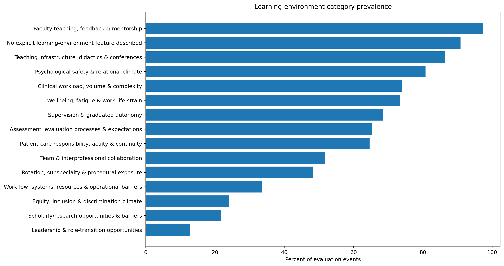
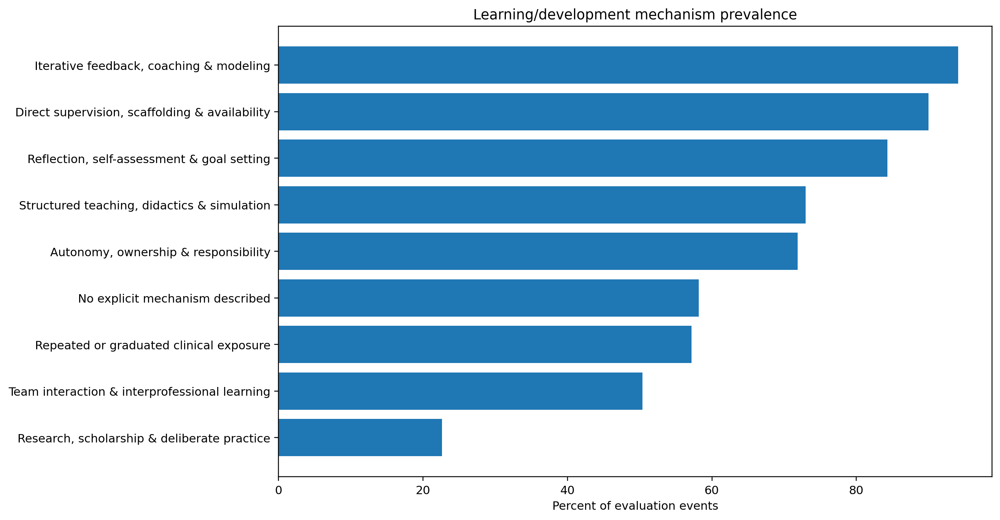
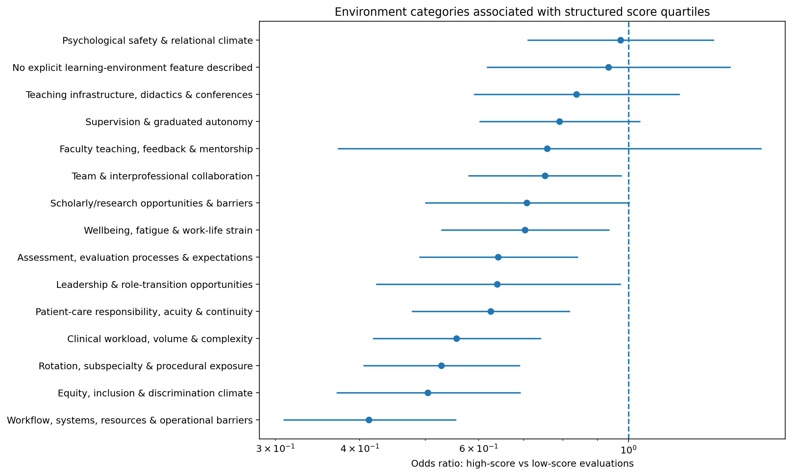
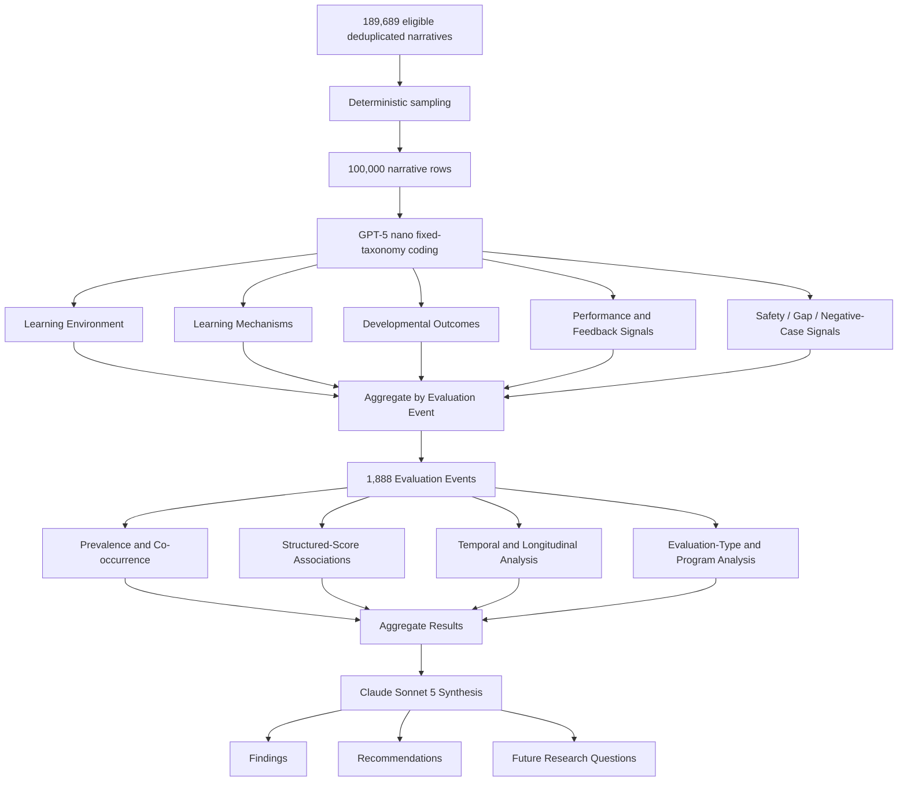

# Large-Scale GMETS Narrative Evaluation Analysis

**AI-assisted mixed-methods analysis of Graduate Medical Education narrative evaluations at 50K and 100K scale**

This repository contains the outputs of a large-scale analysis of Graduate Medical Education (GME) narrative evaluations using a **grounded-theory-informed, fixed-taxonomy framework**, large language models, and event-level statistical analysis.

The project investigates a central question:

> **What can large-scale narrative evaluations tell us about the learning environment, how learning happens, trainee development, feedback quality, and the contextual factors surrounding performance in Graduate Medical Education?**

Two scaled analyses are included:

| Analysis | Narrative rows | Evaluation events |
|---|---:|---:|
| 50K analysis | 50,000 | 1,727 |
| 100K analysis | 100,000 | 1,888 |

The 100K analysis is the primary expanded analysis presented in this repository.

---

## Key Findings at a Glance

The 100K analysis suggests that:

- **Feedback and supervision form the dominant educational pathway.**
- **Psychological safety appears to function as relational infrastructure for learning.**
- **Trainee development is broader than technical competence**, with communication, reasoning, feedback receptivity, and autonomy dominating the developmental profile.
- **Lower-scoring evaluations contain more descriptions of environmental friction**, including workload, workflow barriers, wellbeing strain, assessment context, and rotation-related factors.
- **Narrative and structured performance signals show very low agreement**, suggesting that narrative comments may capture context and mechanisms rather than simply reproducing numerical ratings.
- **Feedback is abundant but only moderately specific and actionable.**
- **Only 0.43% of narrative rows were flagged as possible taxonomy gaps**, suggesting broad codebook coverage.
- The 100K expansion adds substantially more **qualitative depth**, but only modestly increases the number of independent evaluation events.

---

## Selected Results

### Learning-Environment Prevalence



Faculty teaching, feedback, and mentorship appeared in nearly every evaluation event. Teaching infrastructure, psychological safety, workload, wellbeing, and supervision were also highly prevalent.

---

### How Learning Happens



The dominant mechanisms were iterative feedback/coaching, direct supervision/scaffolding, reflection, structured teaching, and progressively increasing autonomy.

---

### High- vs Low-Score Evaluation Context



Several environmental themes appeared more often in lower-scoring evaluations, particularly workflow/system barriers, workload, rotation context, wellbeing strain, assessment context, and equity-related factors.

These are **associations and should not be interpreted causally**.

---

# Project Overview

Graduate Medical Education produces large volumes of narrative evaluation data.

These comments contain information that may not be fully represented by structured numerical scores, including:

- faculty teaching and mentorship
- supervision
- psychological safety
- workload and fatigue
- workflow barriers
- assessment context
- clinical responsibility
- feedback processes
- autonomy
- professional development
- team relationships
- equity and inclusion concerns

Manually analyzing tens of thousands of comments is difficult.

This project explores whether large language models can support a scalable qualitative workflow while preserving key principles of qualitative inquiry such as:

- inductive discovery
- constant comparison
- negative-case analysis
- taxonomy-gap auditing
- theoretical integration

The result is an **AI-scaled mixed-methods analysis** rather than a simple text-classification or topic-modeling exercise.

---

# Analysis Workflow



---

# Study Design

The project follows a **mixed inductive-confirmatory design**.

## Phase 1 — Inductive Discovery

An earlier pilot used inductive/open coding to identify recurring concepts within the narrative corpus.

These concepts informed the initial coding framework.

## Phase 2 — Fixed-Taxonomy Application

The resulting taxonomy was applied to increasingly large datasets:

- 50,000 narrative rows
- 100,000 narrative rows

## Phase 3 — Constant Comparison and Auditing

The pipeline retained mechanisms for identifying:

- taxonomy gaps
- negative cases
- low-confidence classifications
- subgroup differences
- contradictory patterns

## Phase 4 — Quantitative Integration

Narrative codes were aggregated to the evaluation-event level and compared with:

- structured scores
- evaluation type
- program
- calendar time
- repeated evaluatees

## Phase 5 — Theoretical Synthesis

Aggregate analytical results were synthesized into:

- major findings
- cross-table interpretations
- non-obvious patterns
- practical recommendations
- a provisional conceptual model

---

# 100K Analysis

The expanded analysis included:

| Measure | Value |
|---|---:|
| Eligible deduplicated narratives | 189,689 |
| Narrative rows classified | **100,000** |
| Unique evaluation events | **1,888** |
| Programs | **253** |
| Evaluation types | **18** |
| Mean narrative length | ~176 characters |
| Unresolved row failures | **0** |
| Taxonomy-gap rate | **0.43%** |

---

# Unit of Analysis

A critical distinction in this project is the difference between the **qualitative coding unit** and the **statistical unit of analysis**.

## Narrative Row

The LLM classified one deduplicated:

```text
QUESTION + TEXT_RESPONSE
```

pair at a time.

This is the qualitative unit.

## Evaluation Event

Multiple narrative rows could belong to the same evaluation event.

These rows were grouped using a de-identified:

```text
EVALUATION_ID_HASH
```

Most prevalence, co-occurrence, structured-score, and longitudinal analyses were conducted at this event level.

Therefore:

> **100,000 narratives represent qualitative depth; 1,888 evaluation events represent the primary statistical unit.**

This distinction prevents the 100,000 narrative rows from being incorrectly treated as 100,000 statistically independent observations.

---

# AI Models

## Large-Scale Coding

```text
openai-gpt-5-nano
```

Used for structured classification of individual narrative rows.

Outputs included:

- learning-environment codes
- learning-mechanism codes
- developmental-outcome codes
- narrative performance signal
- feedback specificity
- feedback actionability
- classification confidence
- sensitizing constructs
- taxonomy-gap flags
- negative-case flags

---

## Aggregate Interpretation

```text
claude-sonnet-5
```

Used after statistical aggregation to interpret:

- cross-table patterns
- subgroup differences
- unusual findings
- possible theoretical relationships
- practical recommendations
- future research directions

The final synthesis model received **aggregate analytical results rather than raw narrative text**.

---

# Coding Framework

## Learning Environment

The learning-environment taxonomy includes:

| Code | Domain |
|---|---|
| E01 | Faculty teaching, feedback, and mentorship |
| E02 | Supervision and graduated autonomy |
| E03 | Clinical workload, volume, and complexity |
| E04 | Rotation, subspecialty, and procedural exposure |
| E05 | Team and interprofessional collaboration |
| E06 | Leadership and role-transition opportunities |
| E07 | Teaching infrastructure, didactics, and conferences |
| E08 | Scholarship and research opportunities |
| E09 | Psychological safety and relational climate |
| E10 | Workflow, systems, resources, and operational barriers |
| E11 | Wellbeing, fatigue, and work-life strain |
| E12 | Patient-care responsibility, acuity, and continuity |
| E13 | Assessment, evaluation processes, and expectations |
| E14 | Equity, inclusion, and discrimination climate |
| E15 | No explicit learning-environment feature |

---

## Learning Mechanisms

| Code | Mechanism |
|---|---|
| M01 | Iterative feedback, coaching, and modeling |
| M02 | Repeated or graduated clinical exposure |
| M03 | Direct supervision, scaffolding, and availability |
| M04 | Autonomy, ownership, and responsibility |
| M05 | Team interaction and interprofessional learning |
| M06 | Reflection, self-assessment, and goal setting |
| M07 | Structured teaching, didactics, and simulation |
| M08 | Research, scholarship, and deliberate practice |
| M09 | No explicit mechanism |

---

## Developmental Outcomes

| Code | Developmental outcome |
|---|---|
| D01 | Clinical reasoning and diagnostic competence |
| D02 | Procedural and technical competence |
| D03 | Autonomy, confidence, and independent judgment |
| D04 | Communication and teamwork development |
| D05 | Professional identity and leadership formation |
| D06 | Feedback receptivity and self-directed learning |
| D07 | Efficiency, organization, and workflow management |
| D08 | Scholarship, research, and teaching development |
| D09 | Wellbeing, resilience, and coping |
| D10 | No explicit developmental effect |

---

# 100K Results

## Learning Environment

The most prevalent environment categories were:

| Learning-environment category | Events |
|---|---:|
| Faculty teaching, feedback, and mentorship | **97.5%** |
| Teaching infrastructure, didactics, and conferences | **86.3%** |
| Psychological safety and relational climate | **80.8%** |
| Clinical workload, volume, and complexity | **74.0%** |
| Wellbeing, fatigue, and work-life strain | **73.4%** |
| Supervision and graduated autonomy | **68.5%** |
| Assessment processes and expectations | **65.3%** |
| Patient-care responsibility and continuity | **64.6%** |
| Team and interprofessional collaboration | **51.8%** |
| Rotation and procedural exposure | **48.3%** |
| Workflow/system barriers | **33.6%** |
| Equity and discrimination climate | **24.1%** |
| Scholarship and research opportunities | **21.7%** |
| Leadership opportunities | **12.8%** |

These are **event-level prevalence estimates**.

A theme only needs to appear once within an evaluation event for that event to count as containing the theme.

---

## Developmental Outcomes

| Developmental outcome | Events |
|---|---:|
| Communication and teamwork | **93.1%** |
| Feedback receptivity and self-directed learning | **84.5%** |
| Clinical reasoning | **75.6%** |
| Autonomy and independent judgment | **73.1%** |
| Professional identity and leadership formation | **63.9%** |
| Wellbeing, resilience, and coping | **59.2%** |
| Efficiency and organization | **51.4%** |
| Scholarship, research, and teaching development | **34.4%** |
| Procedural and technical competence | **33.5%** |

The developmental profile suggests that GME narratives frequently capture **relational, cognitive, reflective, and professional development**, not only technical competence.

---

## Learning Mechanisms

| Learning mechanism | Events |
|---|---:|
| Iterative feedback, coaching, and modeling | **94.1%** |
| Direct supervision and scaffolding | **90.0%** |
| Reflection and self-assessment | **84.3%** |
| Structured teaching and didactics | **73.0%** |
| Autonomy and responsibility | **71.9%** |
| Repeated clinical exposure | **57.2%** |
| Team interaction | **50.4%** |
| Research/scholarship/deliberate practice | **22.6%** |

Together, these results suggest a recurring developmental sequence:

```text
Clinical experience
        ↓
Supervision
        ↓
Feedback and coaching
        ↓
Reflection
        ↓
Scaffolding
        ↓
Increasing autonomy
```

---

# Major Finding 1 — Feedback and Supervision Form the Educational Engine

Faculty teaching and feedback appeared in nearly every evaluation event.

At the mechanism level:

- feedback/coaching appeared in approximately **94%**
- supervision/scaffolding appeared in approximately **90%**
- reflection appeared in approximately **84%**

This suggests that the dominant educational process is not an isolated teaching event.

Instead, learning appears to occur through repeated interaction among:

```text
clinical experience
+
supervision
+
feedback
+
reflection
+
increasing responsibility
```

---

# Major Finding 2 — Psychological Safety Is Relational Infrastructure

Psychological safety appeared in approximately **80.8%** of evaluation events.

When explicitly examined as a sensitizing construct, psychological-safety signals appeared in approximately **83.7%** of events.

Supervision availability appeared in approximately **76.6%**.

This suggests that an effective learning environment may depend partly on whether trainees can:

- ask questions
- disclose uncertainty
- seek help
- receive supervision
- communicate openly
- make mistakes in a learning-oriented environment

Psychological safety and supervision may therefore represent **relational infrastructure for learning**.

---

# Major Finding 3 — Workload and Wellbeing Are Educational Context

Clinical workload/complexity appeared in approximately **74%** of events.

Wellbeing, fatigue, and work-life strain appeared in approximately **73%**.

Explicit sensitizing constructs included:

| Construct | Events |
|---|---:|
| Psychological safety | **83.7%** |
| Supervision availability | **76.6%** |
| Workload/fatigue | **46.9%** |
| Wellbeing/burnout | **27.1%** |
| Handoff/system failure | **11.8%** |
| Serious patient outcome | **6.5%** |
| Discrimination/bias | **6.4%** |
| Error disclosure | **4.4%** |

Rare constructs should not be interpreted as unimportant.

Some may function as **sentinel educational or safety signals**.

---

# Major Finding 4 — Lower Scores Contain More Environmental Friction

Several themes were substantially more frequent in lower-score evaluation events.

| Category | High-score events | Low-score events | Odds Ratio |
|---|---:|---:|---:|
| Workflow/system barriers | 21.1% | 39.3% | **0.41** |
| Rotation/procedural exposure | 35.8% | 51.3% | **0.53** |
| Equity/discrimination climate | 17.8% | 30.0% | **0.50** |
| Clinical workload/complexity | 62.7% | 75.1% | **0.56** |
| Patient-care responsibility | 55.6% | 66.7% | **0.63** |
| Assessment expectations | 56.4% | 66.9% | **0.64** |
| Wellbeing/fatigue | 66.7% | 74.0% | **0.70** |

These findings do **not** establish that environmental factors caused lower performance.

A more cautious interpretation is:

> **Lower-scoring evaluations contain more descriptions of constraints, burden, workflow problems, and environmental context.**

Narrative comments may therefore help explain a structured score rather than merely duplicate it.

---

# Major Finding 5 — Narrative Performance Is Overwhelmingly Positive

Narrative performance signals were:

| Signal | Percentage |
|---|---:|
| Positive | **93.1%** |
| Neutral / non-evaluative | **5.7%** |
| Mixed | **0.8%** |
| Concern | **0.4%** |

This creates substantial class imbalance.

Rare mixed and concern cases may be particularly valuable for:

- trainee support
- patient safety
- educational quality improvement
- supervision review
- system-level learning

---

# Major Finding 6 — Narrative and Structured Scores Capture Different Signals

Agreement between narrative-derived performance bands and structured numerical-score bands was extremely low.

```text
Quadratic weighted κ ≈ 0.013
```

This suggests that the two sources may capture different dimensions of the evaluation process.

Structured scores may emphasize:

```text
performance judgment
```

while narrative text may more strongly represent:

```text
context
learning processes
relationships
strengths
barriers
supervision
workload
development
```

This leads to one of the central hypotheses from the study:

> **Narrative evaluations may be more useful for explaining the conditions and mechanisms surrounding performance than for reproducing the numerical performance score itself.**

---

# Major Finding 7 — Feedback Has a Quantity–Quality Gap

Feedback is extremely common.

Its specificity and actionability are only moderate.

Examples:

| Evaluation type | Specificity | Actionability |
|---|---:|---:|
| Faculty of resident | 3.15 | 3.23 |
| Faculty of program/hospital | 2.78 | 2.94 |
| Patient/staff of resident | 2.91 | 3.02 |
| Resident self evaluation | 2.94 | 3.06 |
| Resident of service/clinic | 2.97 | 3.13 |
| Resident peer evaluation | 3.18 | 3.28 |
| Resident of faculty | 3.27 | 3.34 |

The intervention target may therefore be:

> **better feedback rather than simply more feedback.**

A possible feedback framework is:

```text
Observed behavior
      ↓
Impact / context
      ↓
Specific next step
```

---

# Major Finding 8 — No Simple Universal Longitudinal Improvement

Among evaluatees with repeated observations:

```text
N = 213
```

Results included:

```text
Mean first-to-last change   ≈ -0.05
Median first-to-last change ≈ +0.08
Positive change             ≈ 51.6%
```

There was no statistically significant overall first-to-last score shift.

This should not be interpreted as evidence that trainees do not develop.

A simple first-versus-last comparison does not account for:

- evaluator differences
- rotation difficulty
- specialty differences
- evaluation instruments
- time spacing
- repeated observations

Longitudinal mixed-effects modeling is a more appropriate next step.

---

# Major Finding 9 — The Taxonomy Appears Broadly Mature

Only:

```text
430 / 100,000 rows
```

were flagged as possible taxonomy gaps:

```text
0.43%
```

Many gap outputs were:

- missing values
- duplicate descriptions
- variants of existing categories
- narrow specialty-specific concepts

This suggests that the broad coding framework is approaching **conceptual saturation**, although human validation remains necessary.

---

# Integrated Working Model

The combined results suggest the following hypothesis-generating model:

```text
LEARNING ENVIRONMENT

Teaching and mentorship
Psychological safety
Supervision
Teaching infrastructure
Workload and wellbeing
Assessment and workflow context

              ↓

LEARNING MECHANISMS

Feedback and coaching
Supervision and scaffolding
Reflection
Structured teaching
Repeated exposure
Increasing responsibility

              ↓

DEVELOPMENT

Communication and teamwork
Feedback receptivity
Clinical reasoning
Autonomy and confidence
Professional identity
Efficiency and organization
```

Potential contextual moderators include:

```text
workload
workflow barriers
wellbeing
assessment expectations
rotation exposure
clinical responsibility
equity/discrimination climate
```

This is a **working conceptual model**, not a demonstrated causal pathway.

---

# 50K → 100K: What Changed?

Increasing the corpus from 50,000 to 100,000 rows doubled the narrative volume but increased the number of evaluation events from:

```text
1,727 → 1,888
```

an increase of only approximately **9.3%**.

This is methodologically important.

The larger analysis primarily provides:

- greater within-event narrative coverage
- greater qualitative depth
- stronger stability of recurring themes
- better opportunity to identify rare cases
- stronger taxonomy-gap assessment

rather than twice the independent statistical sample size.

The broad conceptual findings remained stable across the analyses.

---

# Practical Implications

## Improve Feedback Quality

Consider structured prompts encouraging:

```text
Observed behavior
→ impact/context
→ specific next step
```

Possible measures:

- mean specificity
- mean actionability
- percentage of comments ≥4/5
- differences across evaluation channels

---

## Monitor Psychological Safety and Supervision

Potential program-level indicators include:

- psychological safety
- supervisor availability
- safe help-seeking
- workload/fatigue
- wellbeing signals

---

## Use Low-Score Narratives as Contextual Diagnostics

When scores are low, consider examining whether narratives also contain:

- workflow barriers
- workload problems
- supervision concerns
- wellbeing strain
- rotation limitations
- assessment issues
- equity-related concerns

This may help distinguish individual performance issues from broader environmental contributors.

---

## Review Rare High-Value Cases

Priority review categories may include:

- concern narratives
- mixed signals
- negative cases
- low-confidence outputs
- serious patient outcomes
- bias/discrimination
- handoff failures
- error-disclosure signals

---

# Validation Priorities

The pipeline completed:

```text
100,000 classified rows
0 unresolved technical failures
```

However:

```text
successful processing ≠ validated classification
```

The analysis also identified:

```text
850 zero-confidence rows
21,736 rows below the predefined confidence threshold
1,429 evaluation events containing material requiring adjudication
```

Future validation should report:

- precision
- recall
- F1
- inter-rater agreement
- human–LLM agreement

Validation should oversample rare and difficult classes rather than relying primarily on overall accuracy.

---

# Future Research

## 1. Human Validation

Audit a stratified sample including:

- ordinary cases
- low-confidence classifications
- concern cases
- mixed cases
- negative cases
- taxonomy-gap cases

---

## 2. Row-Level Prevalence

Current results emphasize event-level prevalence.

Future work should also measure:

```text
row-level prevalence
```

and:

```text
within-event proportion of narratives containing each code
```

This would distinguish:

> “This concept appeared somewhere in the evaluation”

from:

> “This concept dominated the evaluation.”

---

## 3. Multivariable Mixed-Effects Modeling

Future analyses should account for clustering by:

- program
- trainee
- evaluator
- evaluation type
- year
- specialty
- repeated observations

---

## 4. Longitudinal Development

A central next question is:

> **Which learning-environment conditions are associated with better trainee development over time?**

Potential analyses include:

- trainee-specific trajectories
- environment × time interactions
- evaluator effects
- program effects
- evaluation-type effects

---

## 5. Prospective Feedback Intervention

A structured feedback intervention could test whether improving specificity and actionability changes:

- feedback quality
- trainee development
- structured ratings
- developmental narratives
- psychological-safety signals
- downstream performance

---

# Central Research Question Going Forward

> **Which learning-environment conditions are associated with improved trainee development after accounting for program, evaluator, evaluation type, time, and repeated observations?**

---

# Repository Contents

```text
LargeDataSetAnalysis/
│
├── README.md
├── LICENSE
│
├── GMETS Analysis - Rick Rejeleene.pptx
├── GMETS_100K_Analysis_Rick_Rejeleene.pptx
│
├── 50kRows/
│   ├── 01_environment_prevalence.png
│   ├── 02_development_prevalence.png
│   ├── 03_mechanism_prevalence.png
│   ├── 04_confidence_distribution.png
│   ├── 05_performance_signal.png
│   ├── 06_high_vs_low_score_odds_ratios.png
│   ├── 07_environment_cooccurrence.png
│   ├── 08_sensitizing_constructs.png
│   ├── 09_feedback_by_evaluation_type.png
│   ├── 10_environment_over_time.png
│   ├── 11_repeated_evaluatee_change.png
│   ├── 12_taxonomy_gap_concepts.png
│   ├── analysis_payload.txt
│   ├── grounded_theory_interpretation.md
│   └── supporting CSV tables
│
└── 100kRows/
    ├── 01_environment_prevalence.png / .pdf
    ├── 02_development_prevalence.png / .pdf
    ├── 03_mechanism_prevalence.png / .pdf
    ├── 04_confidence_distribution.png / .pdf
    ├── 05_performance_signal.png / .pdf
    ├── 06_high_vs_low_score_odds_ratios.png / .pdf
    ├── 07_environment_cooccurrence.png / .pdf
    ├── 08_sensitizing_constructs.png / .pdf
    ├── 09_feedback_by_evaluation_type.png / .pdf
    ├── 10_environment_over_time.png / .pdf
    ├── 11_repeated_evaluatee_change.png / .pdf
    ├── 12_taxonomy_gap_concepts.png / .pdf
    ├── analysis_payload.txt
    └── supporting CSV tables
```

---

# Presentation Decks

### 50K Analysis

[**GMETS Analysis - Rick Rejeleene.pptx**](GMETS%20Analysis%20-%20Rick%20Rejeleene.pptx)

### 100K Analysis

[**GMETS 100K Analysis - Rick Rejeleene.pptx**](GMETS_100K_Analysis_Rick_Rejeleene.pptx)

The 100K presentation includes:

- data provenance
- input definitions
- coding methodology
- figures
- interpretation
- non-obvious findings
- recommendations
- future research roadmap

---

# Important Limitations

### Association does not imply causation

Observed relationships between environmental themes and structured scores are associative.

They should not be interpreted as causal effects.

### Event-Level Saturation

A category only has to appear once among potentially many narrative rows within an evaluation event for that event to count as positive.

This can produce high event-level prevalence.

### LLM Confidence Is Not Calibrated Probability

The confidence output is model-generated and should not be interpreted as a statistically calibrated probability.

### Severe Positive-Class Imbalance

Narrative performance signals are overwhelmingly positive.

Validation metrics therefore need to emphasize precision, recall, F1, and minority-class performance.

### Narrative and Structured Ratings Are Not Interchangeable

The very low agreement observed between narrative-derived performance signals and structured ratings suggests they may represent different constructs.

### Human Validation Is Required

The current pipeline should not be used independently for high-stakes trainee assessment or educational decisions.

---

# Data Governance

This repository contains analytical outputs, summary tables, visualizations, and presentations rather than raw identifiable narrative data.

Users of similar methods should ensure compliance with:

- institutional privacy policies
- data-sharing agreements
- applicable IRB requirements
- institutional rules governing external publication
- appropriate review of program-level results

Program-level or institution-specific outputs should be reviewed before public dissemination or reuse.

---

# Research Status

This is a **research-stage and hypothesis-generating analysis**.

The current findings support:

- methodological development
- exploratory educational research
- hypothesis generation
- quality-improvement planning
- future manuscript development

They should not yet be interpreted as final causal or policy conclusions.

---

# Author

**Rick Rejeleene, PhD**

Artificial Intelligence / Machine Learning  
Graduate Medical Education Analytics

October 2026

---

# Suggested Citation

```text
Rejeleene R. Large-Scale GMETS Narrative Evaluation Analysis:
AI-Assisted Mixed-Methods Analysis of Graduate Medical Education Narratives.
GitHub repository. 2026.
```

Citation information can be updated following peer-reviewed publication.

---

# License

See [LICENSE](LICENSE).

---

## Summary

The analysis supports a view of Graduate Medical Education as a **relational learning system** in which teaching, supervision, psychological safety, feedback, reflection, workload conditions, and increasing responsibility interact.

The results also suggest that narrative evaluations may be particularly useful for understanding the **context and mechanisms surrounding performance**, rather than simply duplicating numerical ratings.

The next progression is:

```text
DISCOVER
   ↓
VALIDATE
   ↓
MODEL
   ↓
INTERVENE
   ↓
MEASURE AGAIN
```